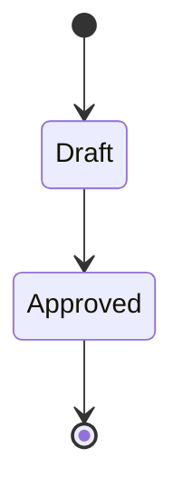

# AI Development Task Specification: {task_title}

## 1. Core Intent
> **[Human Input]** This section describes business objectives and user value.

**Business Objectives**:
- {business_objective_1}
- {business_objective_2}

**Success Criteria**:
- {success_metric_1}
- {success_metric_2}

## 2. Context & Boundaries

- **Primary Impact Scope**:
  - **Codebase**: {repo_link_or_project_path}
  - **Core Files/Modules**:
    - `{file_path}` - (Purpose: {short_purpose})
    - `{file_path}` - (Purpose: {short_purpose})

- **Prohibited Modification Scope**:
  - `{path}/**` - (Reason: {reason})

## 3. Visual Logic Models (Optional & Extensible)
> Include only diagrams that directly help implementation or resolve ambiguity.
> If no diagram is necessary, write: "N/A – logic is trivial or already covered by code."

### 3.1 {diagram_type} (e.g., State Machine / ER / Deployment / User Journey)
- **Purpose**: {one sentence describing what this diagram clarifies}
- **Diagram**:

- **Notes**: {additional notes, edge cases, or pointers to code}

## 4. Interface & Data Definitions (Pick One or Both as Needed)

### 4.1 External API (if any)
- **Protocol**: {HTTP/gRPC/GraphQL/...}
- **Short Description**: {1-2 sentences}
- **Contract Source**:
  - Option A – Link: `{link_to_existing_openapi_or_proto_file}`
  - Option B – Inline: {minimal table or bullet list}
- **Notes**: {auth/pagination/rate limit/etc.}

### 4.2 Internal Data Shapes (if not obvious from the code)
- Source of truth: `{file_path}`
- Additional notes: {critical fields, allowed enum values, nullability}

If there is nothing to add, write:
"No additional interface or data definitions are required; refer to the source code."

## 5. Task Decomposition & Implementation Directives

### Task Group 1: {functional_module_name}
**Purpose**: {why this group exists and why it is grouped this way}
**Related Files**: `{file_path1}`, `{file_path2}`
**Requirements**: {brief spec description for this group}

- **[ ] 1.1: {sub_task_title}**
  - **Input**: {parameters, data, preconditions}
  - **Instructions**:
    1. {step_1}
    2. {step_2}
    3. {multi_file_note_or_framework_guidance}
  - **Objective**: {desired deliverable state}
  - **Acceptance Criteria**:
    - [ ] {verifiable_criteria_1}
    - [ ] {verifiable_criteria_2}
    - [ ] {multi_file_processed_successfully_if_applicable}

- **[ ] 1.2: {sub_task_title}**
  - **Input**: {parameters, data, preconditions}
  - **Instructions**:
    1. {step_1}
    2. {step_2}
  - **Objective**: {desired deliverable state}
  - **Acceptance Criteria**:
    - [ ] {verifiable_criteria_1}
    - [ ] {verifiable_criteria_2}

### Task Group 2: {functional_module_name}
{continue_with_same_structure}

## 6. Implementation Constraints & Guidelines

- **Technology Stack**: {libraries/frameworks}
- **Performance Requirements**: {non_functional_requirements}
- **Coding Standards**: {patterns/style}
- **Error Handling**: {error_semantics}

## 7. Review Checklist
> **[Human Review]** All items must be checked before status changes to APPROVED.

- [ ] **Logic Consistency**: Mermaid diagrams are consistent with task decomposition logic.
- [ ] **Contract Accuracy**: Interface and type definitions reflect PRD requirements.
- [ ] **Implementability**: Acceptance criteria for each subtask are clear, specific, and verifiable.
- [ ] **Boundary Completeness**: Boundary conditions and exception cases are considered.
- [ ] **Scope Compliance**: Implementation plan adheres to defined scope.
- [ ] **Task Group Division**: Task groups follow merging and batching rules.

## Implementation Progress Tracking
- **Requirements Coverage**: [To Implement/Total Requirements]
- **Interface Contracts**: [To Complete/Total Contracts]
- **Acceptance Criteria**: [To Meet/Total Criteria]
- **Specification Compliance**: [To Verify/Total Specifications]

